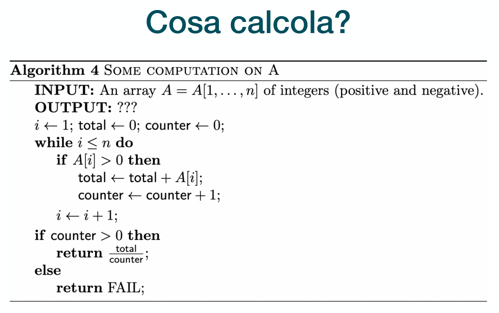
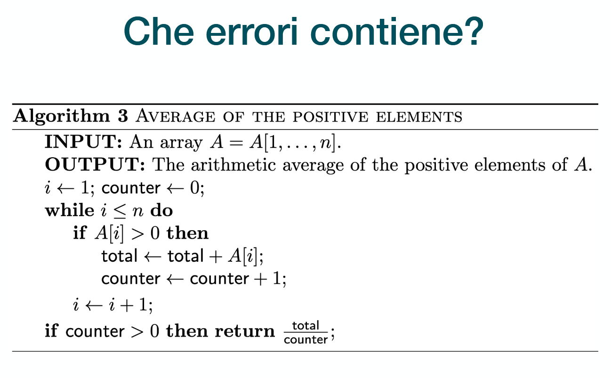
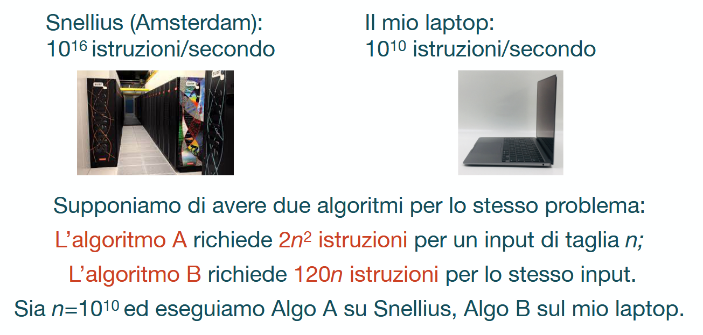
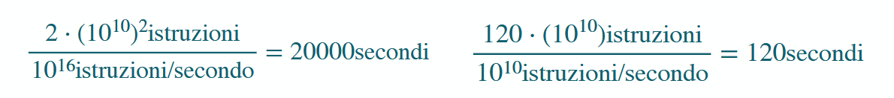
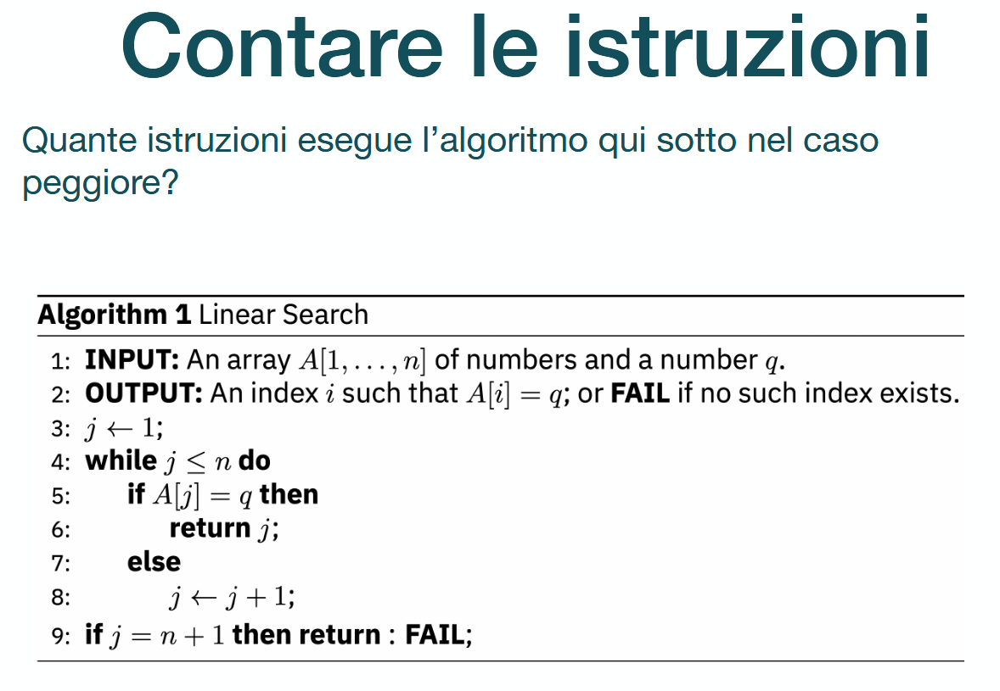

- 
	- Analisi: questo algoritmo somma tutti i numeri maggiori di zero in un array e conta quanti ce ne sono, calcolandone alla fine la media aritmetica
- 
	- L'errore principale che contiene è che non contiene il caso FAIL
- 
	- Il mio laptop sarà sempre più veloce in quanto $120n << 2n^2$
	- 
- 
	- Caso peggiore: $q$ non è nell'array
		- Le righe 3 e 9 eseguite 1 volta ciascuna, aggiungendo 2 unità di tempo insieme
		- La riga 4 viene eseguita $n+1$ volte ($n$ volte per iterare attraverso il ciclo, 1 volta per uscirne)
		- Le righe 5, 7 e 8 vengono eseguite $n$ volte ciascuna (5: ogni elemento dell'array deve essere comparato con $q$, 7: nessun elemento è $q$, 8: siccome nessun elemento è $q$ bisogna incrementare $j$ ogni volta), per un contributo totale $3n$
		- La riga $6$ non viene mai eseguita
			- CORREZIONE: non si conta l'else (struttura di controllo)
	- In totale: $2 + n+ 3n = 4n + 2$