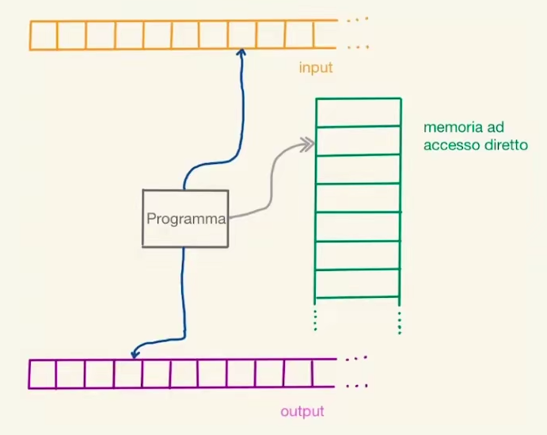

- Modello di calcolo derivato dalla [[Macchina di Turing]] ma migliorato con l'aggiunta di una memoria ad accesso diretto (anch'essa infinita)à
- Ogni cella può contenere un numero grande a piacere
- Le operazioni base definite in questo modello sono:
	- Accesso a memoria (load/store)
	- Operazioni aritmetiche
	- Operazioni di confronto
- 