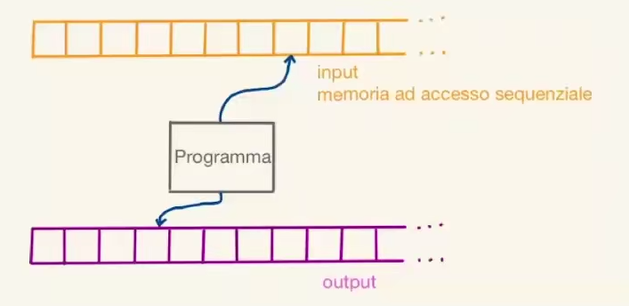

- Primo modello di calcolo considerato per l'esecuzione di [Programmi]([[Programma]])
- Possiede due nastri infiniti a destra, uno con dati in input e uno in output da scrivere
- 
- Permette il calcolo di funzioni di complessità equivalente a un linguaggio di programmazione
- Il suo problema principale è che i nastri sono ad accesso sequenziale, ossia sarebbero troppo lenti in situazioni vere, e per quanto possano aiutare a dare una stima iniziale