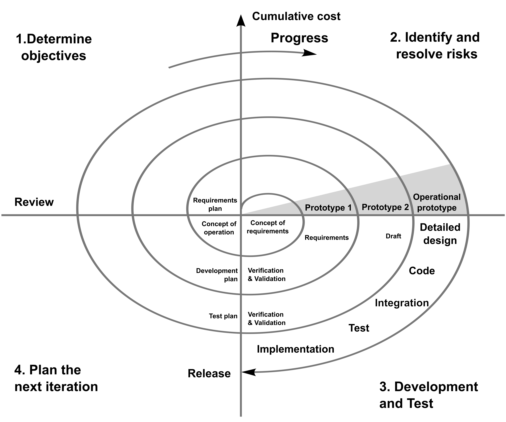

- [[Modello iterativo]] che cerca di modellare altri [Modelli di produzione del software]([[Modello di produzione del software]])
- Totalmente guidato dall'analisi dei rischi
- Costituito dalle seguenti fasi:
	- Determinare gli obiettivi
	  logseq.order-list-type:: number
	- Identificare i rischi
	  logseq.order-list-type:: number
	- Sviluppo e verifica
	  logseq.order-list-type:: number
	- Pianificazione della fase successiva
	  logseq.order-list-type:: number
		- Alla Review, ci si chiede se proseguire
- La spirale indica il costo che aumenta
- 