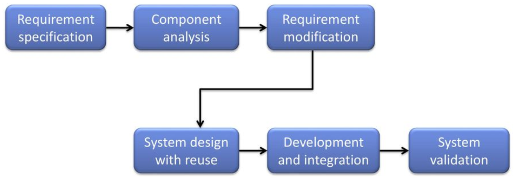

- (Components Off The Shelf)
- [[Modello di produzione del software]] costituito dal riuso di componenti già esistenti per salvare tempo, soldi e fatica
	- Questo necessita di fasi di analisi e retrieval
	- Se necessario, devono essere modificati/adattati
- 