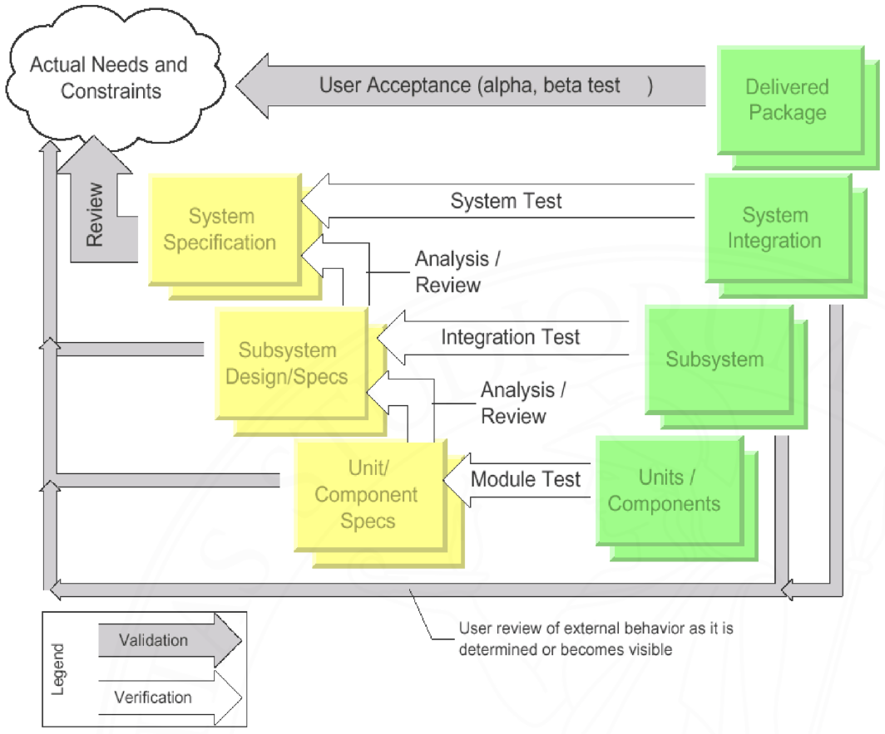

- Iterazione sul [[Modello a cascata]]
- Presenta comunque fasi separate e semilavorati congelati, ma svolge attività di testing per garantire la qualità
	- Testing svolto su:
		- Requisiti (validazione), preoccupandosi di aver svolto "ciò che si voleva"
			- Bisogna coinvolgere il cliente o un suo rappresentante
		- Specifiche (verifica), preoccupandosi di averlo svolto "nella maniera giusta"
- {:height 892, :width 1064}