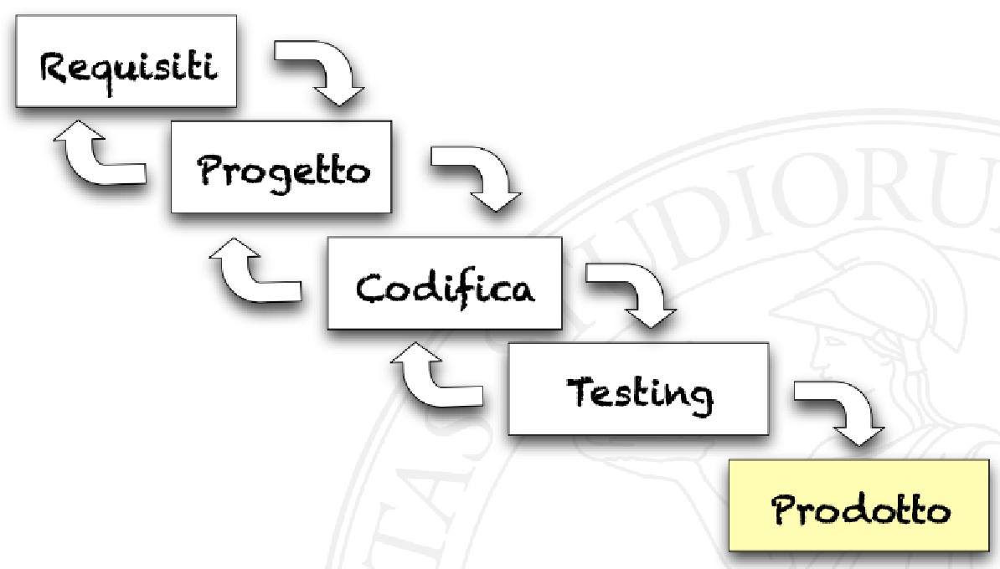

- Iterazione del [[Modello a cascata]] nel quale si può "tornare indietro" e rimettere mano alla fase precedente
	- Una modifica nella fase precedente è detta "iterazione"
- Da sequenziale diventa [[Modello iterativo]]
- 