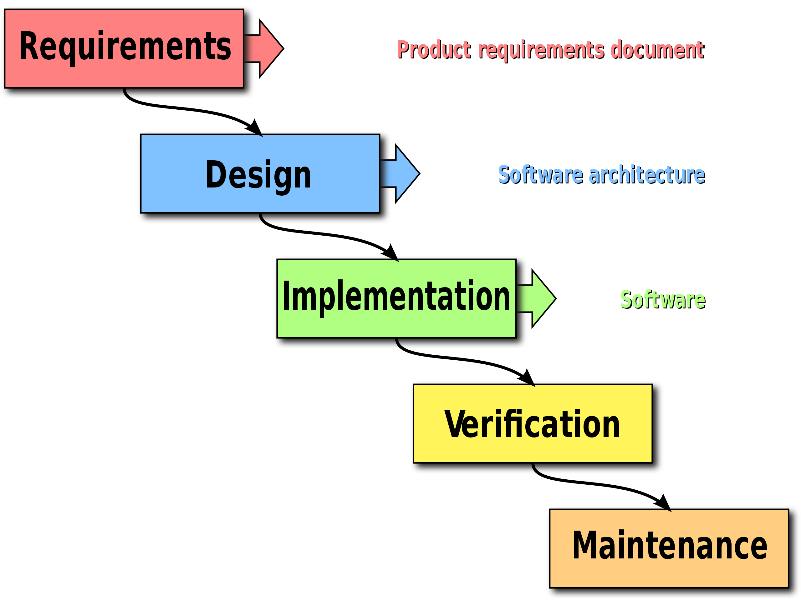

- [[Modello di produzione del software]] sequenziale creato alla fine degli anni '50
	- Diventato famoso negli anni '70 grazie al progeyto SAGE (*Semi-Automated Ground Environment*)
- Costituito da una famiglia di processi sequenziale
	- Non importano necessariamente le fasi, è la separazione dei compiti che conta
- Forza una progressione lineare
	- Impossibile fare modifiche a fasi precedenti
- Ogni fase del processo produce un semilavorato, punto di partenza per la fase successiva
	- Non si svolge una verifica sulla qualità dei passi precedenti
	- Il semilavorato è "congelato"
- Pianifica i tempi e il monitoring dello stato di avanzamento, ma solo a senso unico
	- Se qualcosa va storto, è molto difficile fare "riparazioni" in corsa
	- Aggiungere ulteriore personale al progetto può rallentarlo ulteriormente (problemi di comunicazione)
- La manutenzione è una fase non prevista, in quanto il progetto finale è (idealmente) perfetto
- 