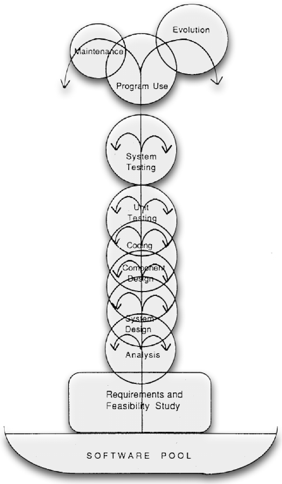

- [[Modello incrementale]] nel quale il "flusso" del processo è rappresentato da uno zampillo della fontana che viene spinto verso l'alto verso le fasi successive
	- Al contrario del modello a cascata, lo zampillo può cadere e ricominciare da capo in qualsiasi fase
- Dopo la consegna, prevede fasi di manutenzione ed evoluzione
	- In questo modo, la consegna non è la fase finale del processo, ma un altro step verso ulteriori sviluppi
- Nonostante i suoi vantaggi, presenta alcuni problemi anch'esso:
	- La pianificazione è complicata in quanto bisogna considerare le potenziali iterazioni
	- Non si converge ad un termine, in quanto tutto è mutabile
	- E' anche difficile definire quanto duri una singola iterazione
	- Troppe iterazioni causano overhead
- {:height 1400, :width 810}