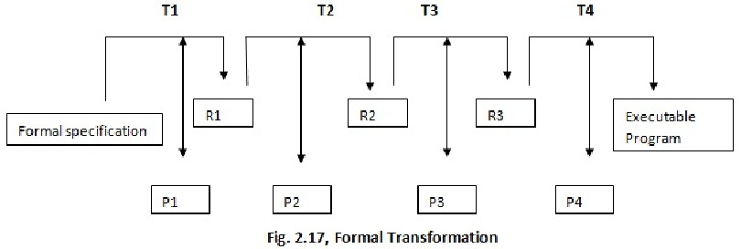

- [[Modello di produzione del software]] nel quale le specifiche, intese come rappresentazioni formali del problema, vengono man mano realizzate concretamente (raffinate)
	- Ogni passaggio crea un prototipo, che è corretto in quanto le trasformazioni sono corrette
	- Il prodotto è consegnabile solo alla fine
- 