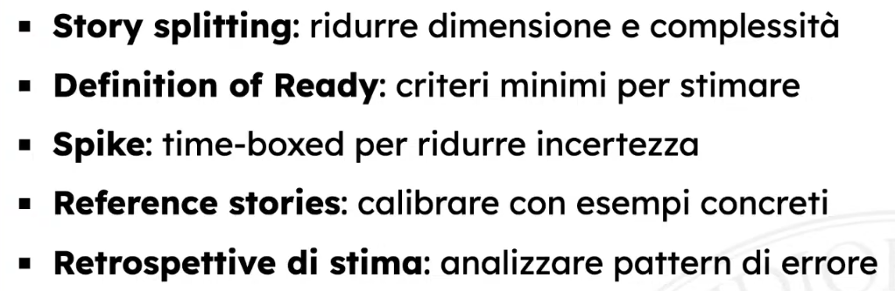

- "Game" nel senso che rende divertente una cosa precedentemente noiosa/odiata
- Basato su "use stories" create dall'utente, scritte in linguaggio naturale
	- Permette di determinare le funzionalità del prossimo rilascio (in base a priorità commerciali e valutazioni tecniche)
- Per descrivere una funzione, il cliente prepara delle carte con sopra:
	- Una breve frase di descrizione
	- Un caso di test (opzionale)
	- Il valore di business che ha
- Ogni sviluppatore, leggendo la carta, stima il tempo necessario per lo sviluppo
	- Dunque la responsabilità va dal manager (imposizione) agli sviluppatori (autodeterminazione)
	- Esempi di tecniche usate:
		- Planning Poker
			- Ognuno sceglie una carta per determinare la propria stima di tempo
			- Coloro che ha scelto valori max e min hanno 1min per spiegarsi
			- Si ripete fino a convergenza
		- Team Estimation Game
			- Fase 1: Valutazione comparativa
				- I developer si mettono in fila
				- Si crea una pila di carte
				- Si mette la prima carta al centro del tavolo
				- Il primo dev prende la carta più in alto sulla pila, la legge, e la mette
					- A destra se è più grande
					- A sinistra se è più piccola
					- Sotto se è equivalente
				- Il prossimo dev può posizionare una carta o spostarla (motivandosi)
				- Si ripete il processo fino a quando ogni carta è stata tolta dalla pila e nessun developer vuole spostare una carta
			- Fase 2: Quantificare distanze
				- I developer si rimettono in fila
				- Usando le carte del Planning Poker, il primo developer assegna il valore 2 a una delle colonne
				- Il developer successivo assegna il valore successivo a una o due colonne
				- Il developer successivo può
					- Prendere una nuova carta e posizionarla
					- Spostare una carta (motivandosi)
					- Passare (se non ci sono carte nella pila e vuole spostarle)
				- Si ripete il processo fino a quando non ci sono più carte sulla pila e nessun developer vuole spostare una carta
					- Le colonne senza valore vengono assimilate alla colonna a sinistra
			- Fase 3: Scala assoluta
				- Si stima il tempo in ore/uomo di una delle carte più semplici (come quella col valore 2)
				- Gli altri sono calcolati proporzionalmente (rischiando però di sovra/sottostimare)
				- Si tiene in mente la velocity (capacità osservata di completare lavori da parte del team)
					- Dopo aver sviluppato la prima iterazione, il team dirà che può sviluppare tanti "punti" quanti ne ha appena fatti
					- Ovviamente questo non vale se cambia la composizione del team
					- Inoltre, non è una scala oggettiva, ma permette comunque di compensare a tendenze di stime sbagliate nei team
					- Non è metro di valutazione tra team o nel tempo
	- Pratiche di miglioramento delle stime:
		- 
- Il manager, basandosi sulle informazioni date, decide quali feature verranno implementate alla prossima iterazione
- Il consenso raggiunto alla fine si basa di più sull'intelligenza collettiva degli sviluppatori e meno sulle singole idee degli individui
	- Riduce il bias individuale
	- Aumenta le prospettive di analisi
	- Condivide le responsabilità (tu aiuti nel creare la stima e perciò ti impegni)
- Creare queste stime condivise ha però dei problemi:
	- Si perde tempo discutendo
	- L'anchoring effect (dipendenza dai primi pezzi di informazione che si ottengono)
	- L'effetto Dunning-Kruger (ossia persone incompetenti sovrastimano la loro competenza)
- NB: troppe persone != riduzione di tempo. Esiste una grandezza ideale di un team, e andare oltre è un mero aumento di costo inutile