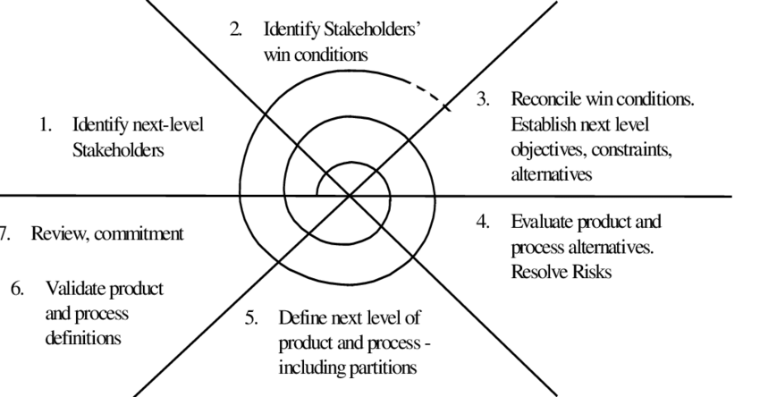

- Variante del [[Metamodello a spirale]] nel quale si evidenzia il rischio causato dai rapporti tra clienti e sviluppatori
	- Se non si contratta in modo giusto, possono fallire
- Detto win-win in quanto che entrambe le parti pensano di vincere
- {:height 452, :width 850}