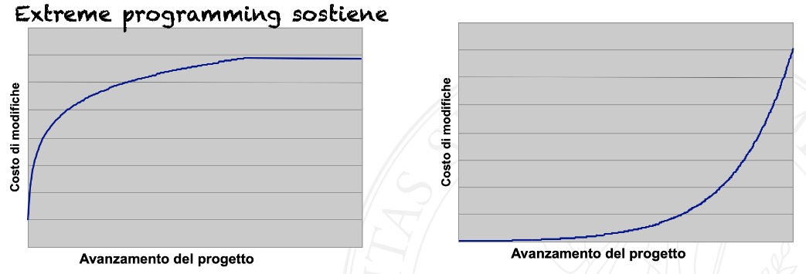
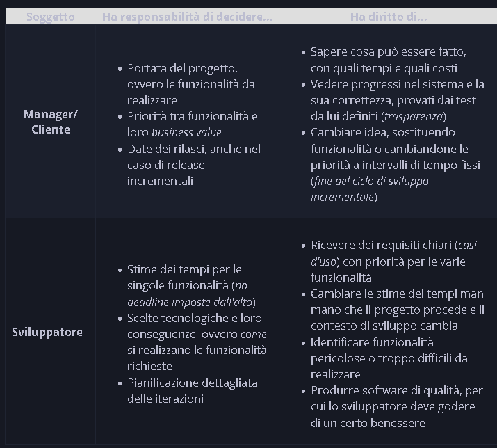

- [[Metodologia Agile]] costituita da due "momenti" dello sviluppo:
	- Scrittura di codice
	- Refactoring (riscrittura che migliora il codice ma non cambia effettivamente il processo)
- Caratterizzata da "increment then simplify"
- Seguendo questa metodologia, si tengono in gioco le seguenti variabili:
	- Portata (quantità di funzioni da implementare, mutevole)
	- Tempo (quanto tempo si può dedicare al progetto)
	- Qualità (qualità del progetto da ottenere)
	- Costo (Risorse finaziare da ottenere)
- Contrapposto a SWENG classica:
- |XP|Classica|
  |---|
  |Feedback rapido|Separazione degli interessi (ossia considerare un aspetto alla volta)|
  |Presumere la semplicità (non fare future-proofing)|Astrazione e modularità|
  |Accettare il cambiamento|Anticipazione del cambiamento (design for change), generalità|
  |Modifica incrementale|Incrementalità|
  |Lavoro di qualità (ossia la gente deve essere felice; meno straordinari etc.)|Rigore e formalità|
- Studio di Bohem relativamente al cambio di costi:
- 
	- Nella SWENG tradizionale, più si avanza più costa tutto
	- In XP, anche se logicamente è meglio cambiare prima, il costo dopo un po' diventa fisso
	- Non 100% affidabile, in 1) quanto si parlava del cost-to-fix e non del costo per la modifica in se e 2) non aveva dati totalmente affidabili
- Figure in gioco e le loro responsabilità:
	- 
- Costituito da dodici pratiche
	- [[Approccio XP]]