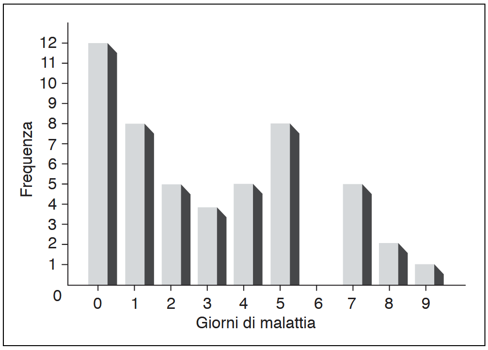
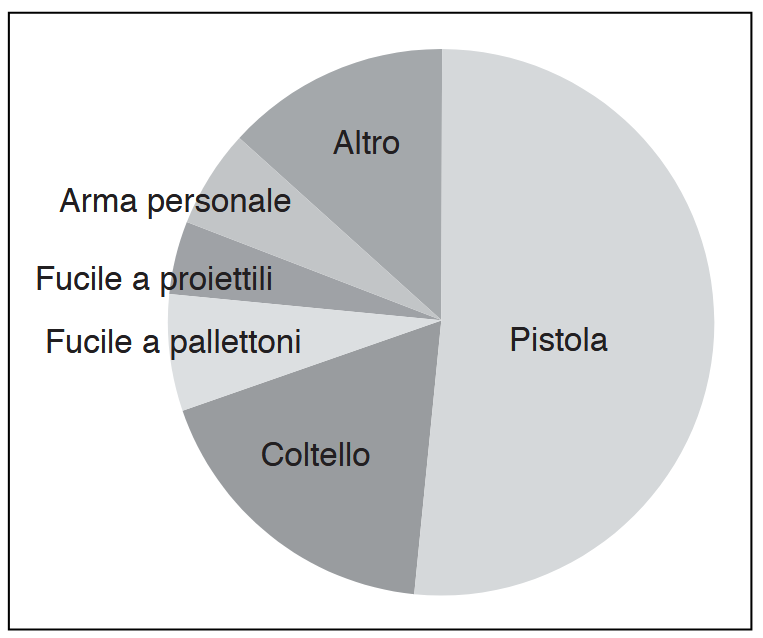
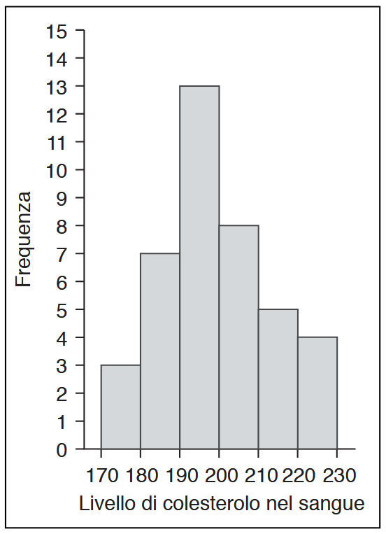

## Grafico a bastoncini
- ![{:height 745, :width 1034}
- ## Grafici a barre
- 
- ## Grafico poligonale
- ![{:height 720, :width 928}
- ## Grafico a torta
- Ogni settore è una frequenza
- 
- ## Istogramma
- 
- Permettono di rappresentare il grado di [[Simmetria]], [[Dispersione]] e [[Concentrazione]] dei dati